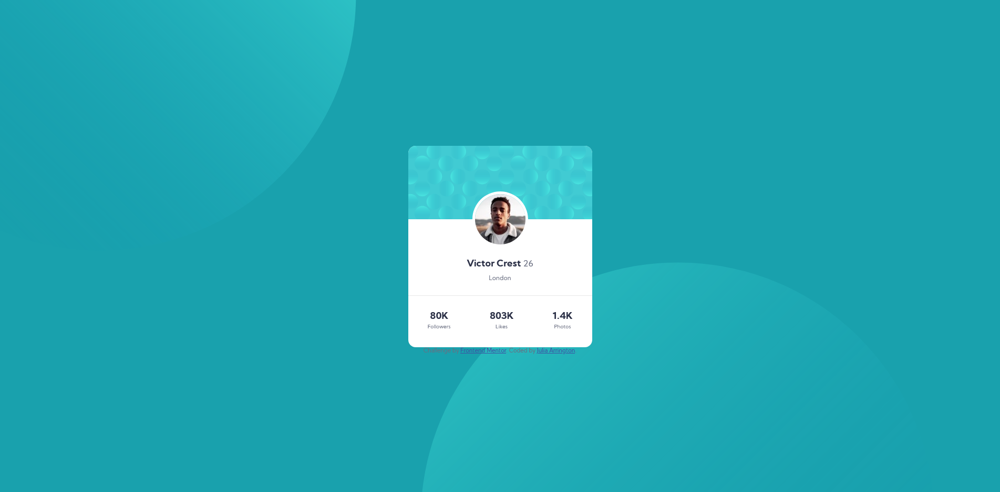

# Frontend Mentor - Profile card component solution

This is a solution to the [Profile card component challenge on Frontend Mentor](https://www.frontendmentor.io/challenges/profile-card-component-cfArpWshJ). Frontend Mentor challenges help you improve your coding skills by building realistic projects.

## Table of contents

- [Overview](#overview)
  - [The challenge](#the-challenge)
  - [Screenshot](#screenshot)
  - [Links](#links)
- [My process](#my-process)
  - [Built with](#built-with)
  - [What I learned](#what-i-learned)
  - [Continued development](#continued-development)
- [Author](#author)

## Overview

### The challenge

- Build out the project to the designs provided

### Screenshot



### Links

- Solution URL: [Add solution URL here](https://github.com/partum/profile-card-component-main)
- Live Site URL: [Add live site URL here](http://juliaarrington.com/portfolio/profile-card/index.html)

## My process

### Built with

- CSS custom properties
- Flexbox

### What I learned

Use this section to recap over some of your major learnings while working through this project. Writing these out and providing code samples of areas you want to highlight is a great way to reinforce your own knowledge.

To see how you can add code snippets, see below:

```html
<p style="font-size: 12px">London</p>
```

I wanted to add a small style rule to one component, so instead of figuring out what selector should be use specificaly I just used inline CSS.

```css
body {
  display: flex;
  align-items: center;
  justify-content: center;
}
```

This snippet is important to center items both horizontaly and verticaly.

### Continued development

I think the most obvious improvement I need to make is with positioning background images. I know they look off, but I don't know how to make them perfect. I also don't know how to position them so they look right in the mobile view. Now that I type this I realize the answer is media quires.
The other thing I want to improve is my positioning skills. I think my work /looks/ right but I'm not sure I went about it in the right way.

## Author

- Website - [Add your name here](https://www.juliaarrington.com)
- Frontend Mentor - [@yourusername](https://www.frontendmentor.io/profile/partum)
